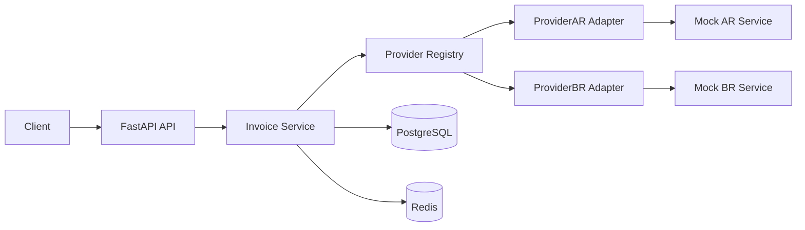

# ripio-challenge

Servicio de facturacion multi-pais en Python con routing por proveedor, idempotencia, retries con backoff, y auditoria completa por intento.

## 1. Arquitectura

La arquitectura detallada de decisiones y trade-offs esta en [ARCHITECTURE_SPEC.md](ARCHITECTURE_SPEC.md).

### Diagrama



## 2. Stack

- Python 3.12+
- FastAPI
- SQLAlchemy
- PostgreSQL
- Redis
- httpx
- JSON structured logs (stdout)
- Docker Compose
- pytest + respx + fakeredis

## 3. Endpoints

- `POST /invoices`
- `GET /invoices/{invoice_id}`
- `GET /providers`
- `GET /metrics`
- `GET /health`

Autenticacion minima por header `X-API-Key`.

## 4. Ejecutar local con Docker

1. Levantar stack completo:

```bash
docker compose up --build
```

2. Validar salud:

```bash
curl http://localhost:8000/health
```

## 5. OpenAPI y Postman

- OpenAPI JSON: `http://localhost:8000/openapi.json`
- Swagger UI: `http://localhost:8000/docs`
- Coleccion Postman: [postman_collection.json](postman_collection.json)

El endpoint `GET /metrics` requiere `X-API-Key` y devuelve metricas agregadas en memoria del proceso:

- total de requests
- conteo por familia de status (`2xx`, `4xx`, `5xx`, etc.)
- latencia agregada por `(method, path, status_code)`

Opcionalmente, podes crear `.env` desde `.env.example` para sobreescribir valores por defecto.

## 6. Politica de idempotencia y estados

- Header requerido: `X-Idempotency-Key`
- Reintento con misma key y mismo payload: retorna misma factura sin nuevo llamado externo.
- Reintento con misma key y payload distinto: `409 IDEMPOTENCY_KEY_CONFLICT`.
- `pending` se usa solo en resultados ambiguos del proveedor (timeout/red/5xx agotando retries).
- La reconciliacion de `pending` se ejecuta fuera del request de lectura (background poll configurable).

## 7. Auditoria

Cada intento guarda:

- proveedor
- payload enviado
- respuesta recibida
- duracion
- estado del intento
- timestamps

La auditoria es consultable via `GET /invoices/{invoice_id}`.

## 8. Logging y observabilidad minima

En esta iteracion se incluye un stack de observabilidad minimo orientado a entrega:

- logs estructurados JSON en stdout
- `X-Correlation-ID` propagado request -> respuesta -> proveedor externo
- logs de request con metodo, path, status y latencia
- logs de negocio para lock de idempotencia, intentos a proveedor y estado final

Configuracion:

- `LOG_LEVEL=INFO` (default)

Como ver logs:

- con Docker Compose: `docker compose logs -f app`
- en local con uvicorn: los logs salen por stdout en formato JSON

Ejemplo de linea de log:

```json
{
    "timestamp": "2026-09-16T12:00:00+00:00",
    "level": "INFO",
    "logger": "app.request",
    "message": "request_completed",
    "event": "request_completed",
    "correlation_id": "f2b...",
    "method": "POST",
    "path": "/invoices",
    "status_code": 201,
    "duration_ms": 132
}
```

## 9. Como agregar un nuevo proveedor/pais

1. Crear adaptador nuevo en `app/providers/<nuevo>.py` implementando contrato de `ProviderAdapter`.
2. Definir mapping de payload y normalizacion de respuesta del proveedor.
3. Registrar el nuevo adaptador en `ProviderRegistry` (`app/providers/registry.py`).
4. Agregar pruebas de integracion del nuevo pais.

No es necesario modificar el core de emision (`InvoiceService`).

## 10. Tests

Correr pruebas:

```bash
python -m pytest -q
```

Cobertura implementada:

- flujo exitoso
- fallo transitorio de proveedor externo
- idempotencia hit
- conflicto por reuso de key con payload distinto

## 11. Decisiones tecnicas y trade-offs

1. PostgreSQL + Redis en vez de quedarme en SQLite.

Fui por esta combinacion porque queria consistencia real en datos y un manejo serio de idempotencia/concurrencia.
SQLite me servia para demo rapida, pero para este problema preferi algo mas cercano a un escenario productivo.

Trade-off: hay mas piezas para levantar y operar.

2. Monolito modular con puertos/adaptadores en vez de microservicios.

Aca priorice foco: separar bien responsabilidades sin sobredisenar.
Queria que sumar un proveedor nuevo sea claro y no implique tocar todo el core.

Trade-off: no tengo el aislamiento de despliegue que tendria en microservicios.

3. Usar `pending` cuando el resultado con el proveedor es ambiguo.

Esta fue una decision muy consciente: ante timeout/5xx prefiero admitir incertidumbre antes que mentir con un `failed` y arriesgar doble facturacion en un reintento.

Trade-off: despues hay que reconciliar ese estado.

4. Mantener la emision en flujo sincrono (request/response) en esta version.

A proposito no meti colas ni workers async en esta entrega. Para el challenge preferi priorizar trazabilidad e idempotencia de punta a punta en un flujo facil de seguir y demostrar.

Trade-off: bajo carga alta, este enfoque escala peor que un modelo asincronico con cola y workers dedicados.

5. Auth minima por API Key en esta etapa.

No quise hacer una sobre-ingeniería con un IAM enterprise a medias. Para el alcance del challenge preferi una capa simple, explicable y funcional.

Trade-off: no cubre escenarios avanzados (roles, scopes, federacion, rotacion compleja).
